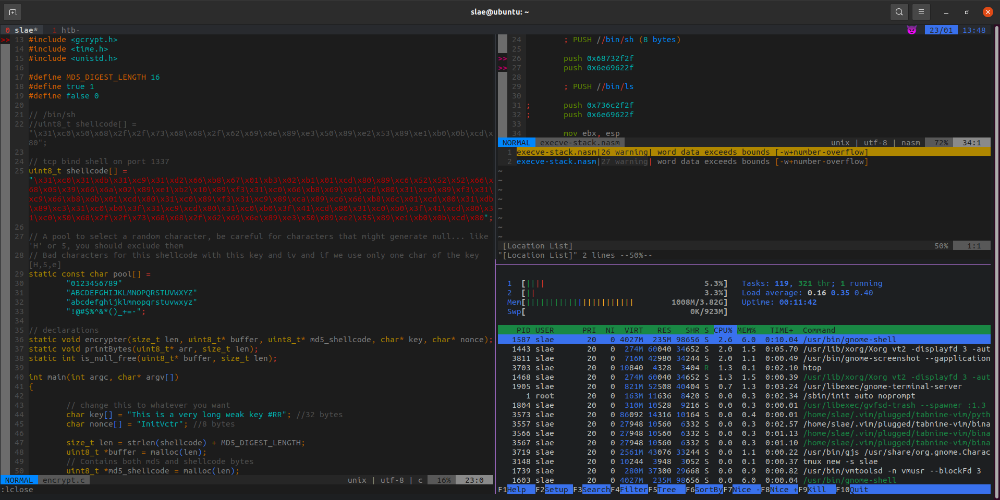

# dotfiles
A collection of my personal dotfiles.

Preview



## Installation

I use the google dark theme from [base16-shell](https://github.com/chriskempson/base16-shell).
To get this script you do the following
```
git clone https://github.com/chriskempson/base16-shell.git ~/.config/base16-shell
```

Then you will need to install xclip so you can use the clipboard for copy/paste outside of tmux, for ubuntu you can do it like this

```
sudo apt-get install --assume-yes xclip
```
Add the following to your .bashrc or .zshrc file
```
export TERM="screen-256color"
#remap Caps to Ctrl
setxkbmap -layout us -option ctrl:nocaps

# Base16 Shell
BASE16_SHELL="$HOME/.config/base16-shell/"
[ -n "$PS1" ] && \
    [ -s "$BASE16_SHELL/profile_helper.sh" ] && \
            eval "$("$BASE16_SHELL/profile_helper.sh")"

```

[Vim plug](https://github.com/junegunn/vim-plug) - plug in manager
```
mkdir ~/.vim && cd .vim && mkdir ~/.vim/autoload

curl -fLo ~/.vim/autoload/plug.vim --create-dirs \
    https://raw.githubusercontent.com/junegunn/vim-plug/master/plug.vim
```

Backup your current dot files and then copy these dot files to your home path.

Launch Vim and run
```
:PlugInstall
```
